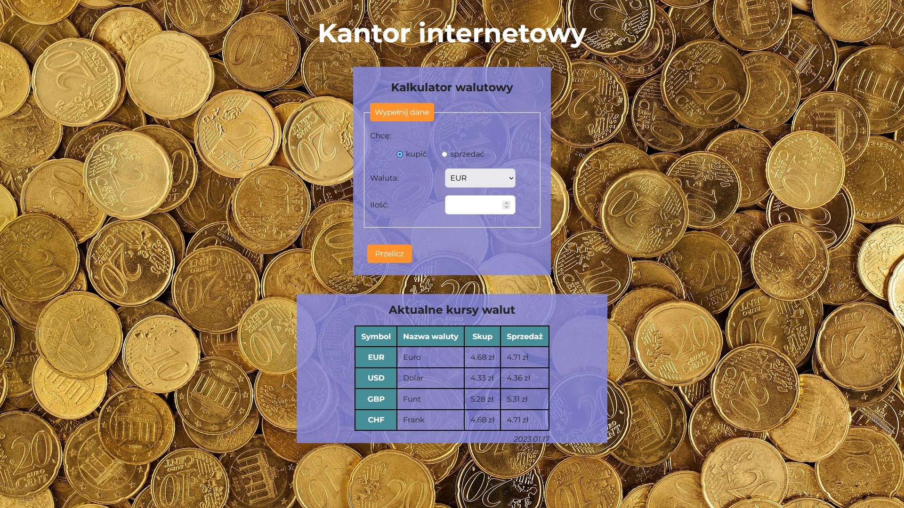

# currency-conventer --- small project after 4 module

## Description

This is a simple currency converter between the Polish currency and a few other major currencies.

If you want to use it:
1. Choose **buy** (*kupić*) or **sell** (*sprzedać*).
2. Choose **currency** (*waluta*).
3. Enter **amount** (*ilość*).
4. Press the button **Przelicz**.

## Demo

[currency-conventer](https://o-pawel.github.io/currency-converter/)

## Technolohies used in this project:
- HTML
- CSS
- JS 
- BEM

## About author

I am currently working as a teacher, but I would like to change my job. I'm trying as much as I can, although it's not easy.
